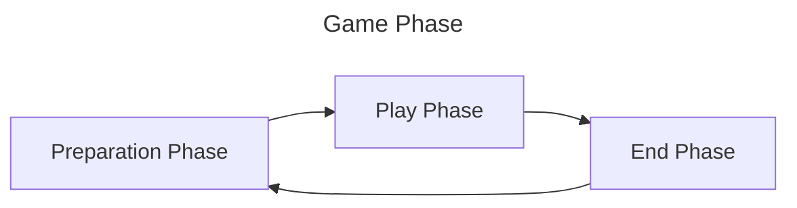
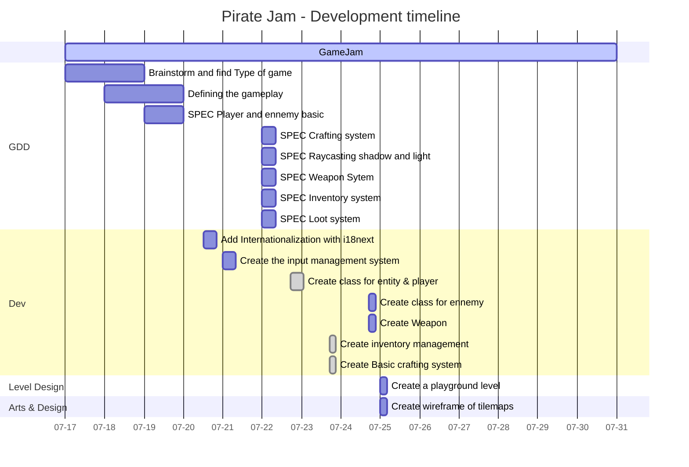
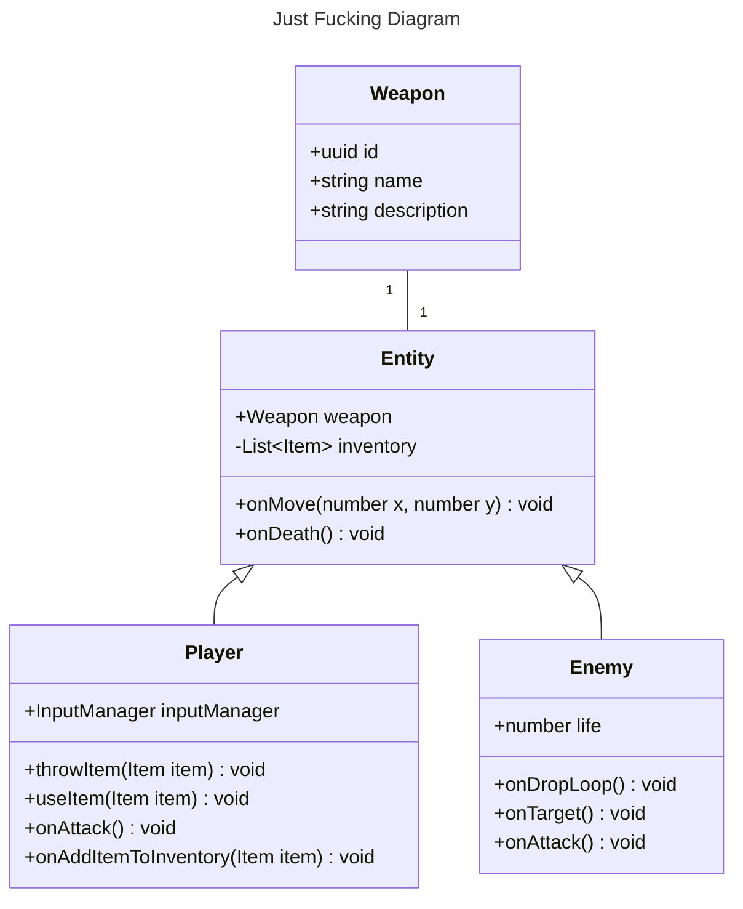
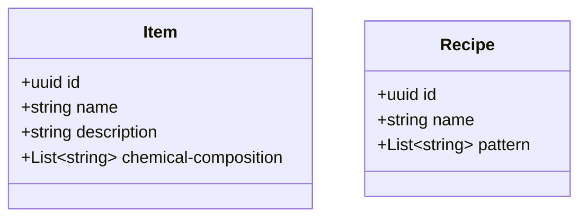

<header style="text-align:center">
	<h1>Codename: Pirate</h1>
	<h2>Design Document</h2>
	
By Nut'Ela for Jam Pirate Software 15

</header>

---

1. <a href="#introduction" style="font-size: 24px">Introduction</a>
   1. [Game Summary](#game-summary)
   2. [Inspiration](#inspiration)
   3. [Player Experience](#player-expererience)
   4. [Platform](#platform)
   5. [Game Engine](#game-engine)
   6. [Genre](#genre)
   7. [Target audience](#target-audience)
2. <a href="#concept" style="font-size: 24px">Concept</a>
	1. [Gameplay overview](#gameplay-overview)
	2. [Theme Interpretation](#theme-interpretation)
	3. [Mechanics](#mechanics)
3. <a href="#arts" style="font-size: 24px">Arts</a>
	1. [Theme](#theme)
	2. [Design](#design)
4. <a href="#game-experience" style="font-size: 24px">Game Experience</a>
	1. [UI](#ui)
	2. [Control](#control)
5. <a href="#development-timeline" style="font-size: 24px">Development Timeline</a>
---

# Introduction
## Game Summary
> WIP

## Genre

**Main Genre**
#action, #2d, #alchemy, #crafting, #beat-them-all

### Inspiration

<section style="width:100%; display: flex; justify-content: space-around; gap: 1rem">
	

		<h4 style="text-decoration: underline">Hotline Miami</h4>
		
<strong>Hotline Miami</strong> is the main inspiration for the game, with its simple, effective gameplay loop consisting of <strong style="color: orange">eliminating all the enemies in a level</strong>. 

		
The controls are accessible to all players, and the <strong style="color: orange">objective is clear</strong> from the first game.

	

	
</section>

<section style="width:100%; display: flex; justify-content: space-around; gap: 1rem">
	

		<h4 style="text-decoration: underline">Project Zomboid</h4>
		
<strong>Project Zomboid</strong> is a full-featured survival game that <strong style="color: orange">is difficult to play if you don't prepare well</strong>. 

		
Nevertheless, the game is simple: <strong style="color: orange">you have to collect resources</strong> to survive as long as possible, but you can collect all you want without preparation, it's worth nothing.

	

	
</section>

## Player Experience
The player begins the game by preparing his weapons and secondary items, and then begins the level, seeing only what's in his field of view. The goal is to learn every aspect of the level, as well as the location and pattern of the various enemies, in order to complete the level. 

## Platform
The Game is developed to be release on **web**.

## Game Engine & Tools

## Target Audience
The target audience is pretty much every type of gamer, from the casual to the meticulous.
The gameplay mechanics are very simple: run, hit, throw, use. There is also a logic to the gameplay and preparation.
It is important to keep the game accessible and as simple as possible, but rigor is still required.

---
# Concept
## Gameplay Overview
In this game, the game loop consists of going through the different rooms of the level to eliminate all the enemies.
To do this, the game phase is divided into 2 main parts:
1. The preparation phase, in which you build and equip a weapon and the various items you'll need to complete the level
2. The play phase, which consists of going through all the rooms to eliminate all the enemies in the level using your arsenal.
3. The end phase is optional, 
	- the player can just use the exit door to finish the level.
	- You can also continue searching for objects that can be useful in the preparation phase.

## Mechanics
> WIP

---
## Arts
## Theme
> WIP

## Design
> WIP

___
## Game Experience
## UI
> WIP

## Control
| Keyboard    | Gamepad                        | Action       |
| ----------- | ------------------------------ | ------------ |
| Arrow Up    | D-Pad Up \| Axis X Up          | Move Up      |
| Arrow Down  | D-Pad Down \| Axis X Down      | Move Down    |
| Arrow Left  | D-Pad Left \| Axis X Left      | Move Left    |
| Arrow Right | D-Pad Right \| \| Axis X Right | Move Right   |
| Z \| W      | Y                              | Attack Up    |
| S           | B                              | Attack Down  |
| Q \| A      | A                              | Attack Left  |
| D           | X                              | Attack Right |
| A \| Q      | LB                             | Item 1       |
| E           | RB                             | Item 2       |
| X           | LT                             | Item 3       |
| C           | RT                             | Item 4       |
| Escape      | Start                          | Pause        |
| Tab \| I    | Select                         | Inventory    |

___
## Development Timeline

## Specification

